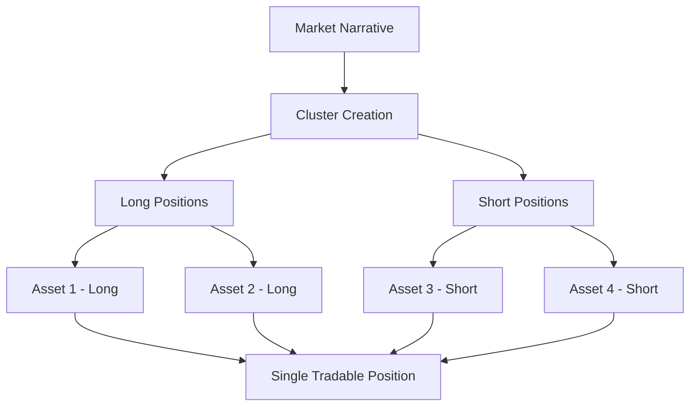

How Bull vs. Bear Works
Bull vs. Bear is a narrative trading platform that allows anyone to run Long-Short strategies in one transaction using USDC as collateral.

Deposit USDC
Select your long and short tokens
Choose your size and leverage
Confirm your trade
Monitor your position's performance
Close your position at any time to realize profits or cut losses
Your USDC earns lending yield while you trade.

What is Bull vs. Bear?
Bull vs. Bear is a narrative trading platform that allows anyone to run Long-Short strategies in one transaction using USDC as collateral. 100% of your USDC earns lending yield while you trade.

What are the risks?
Bull vs. Bear uses Mars Protocol to enable users to execute leveraged Long-Short strategies in a single transaction. Trading with leverage involves borrowing funds from the platform, which increases both potential gains and risks. If the asset price moves significantly against your position, your trade may be liquidated to cover the borrowed funds. Before trading, ensure you fully understand how leverage works and never risk more than you can afford to lose.

How do positions work?
A position is a Long-Short trade that you've opened or closed on Bull vs. Bear. Your position's profit and loss (PnL) will increase or decrease based on the price movements of the assets you longed and shorted. You can monitor the details and performance of your open positions at the bottom of the Trade page. Here, you can manage and share your position with your friends on Twitter/X.

What is liquidation?
Liquidation occurs when an open position is automatically closed because its value has dropped too far relative to the borrowed amount. This ensures the platform can recover the borrowed funds. The liquidation price is shown for each position.

What is the minimum amount of USDC I can deposit?
The minimum position size for each trading pair is $10. You can either use at least 10 USDC as collateral or a smaller amount with leverage. For example, with 4x leverage, you could open a position with just 5 USDC, making the total trade value $20.

Are positions cross-collateralized?
No, positions are not cross-collateralized. Each position is managed independently, meaning the collateral for one trade will not be used to support another. This ensures liquidation risk is contained within individual positions rather than affecting your entire account.

How do clusters work?
Cryptocurrencies are often driven by narratives. Clusters make it easy to trade on narratives by bundling multiple long and short positions into one. Each cluster contains a mix of assets with custom weights — for example, a 50/50 BTC-ETH long cluster would use 50% of the money to long BTC and 50% to long ETH.

To trade clusters:

Deposit USDC (it will earn lending yield while you trade)
Select a pre-made cluster or create your own by selecting long and short tokens
Choose your size and leverage
Confirm your trade
Clusters use leverage, which involves borrowing funds from the platform, increasing potential gains and risks. If an asset price within a cluster moves significantly against your position, your cluster trade may be liquidated to cover the borrowed funds. You can monitor your performance, track liquidation prices, and manage your cluster positions on the Trade and Cluster tabs.

What is funding?
Funding rates are periodic payments between long and short traders in leveraged markets, designed to keep contract prices aligned with the underlying assets. When the rate is positive, long positions pay shorts; when negative, shorts pay longs.

## Strategic Trading with Bull vs. Bear

Bull vs. Bear is Neutron's innovative trading platform that enables users to create and execute sophisticated long-short strategies through narrative-based Clusters. It provides a powerful way to gain targeted exposure to specific market narratives without managing multiple individual positions.

## What are Clusters?

  Clusters are strategic groupings of multiple long and short positions packaged into a single tradable unit. This allows traders to express directional views on broader market narratives or trends, rather than individual assets.

## Key Features

  

    

      <svg xmlns="http://www.w3.org/2000/svg" viewBox="0 0 24 24" fill="currentColor" className="w-8 h-8">
        <path fillRule="evenodd" d="M15.22 6.268a.75.75 0 01.44.97l-2.47 7.41c-.9.25-.27.42-.48.452-.25.066-.51-.01-.7-.2l-3.36-3.36a2.25 2.25 0 00-3.18 3.18l3.36 3.36c.19.19.266.451.2.7a.75.75 0 01-.45.48l-7.41 2.47a.75.75 0 01-.97-.44l-.592-2.22a.75.75 0 01.544-.92l3.96-1.32a.75.75 0 00-.326-1.47l-3.96 1.32a.75.75 0 01-.92-.544l-.592-2.22a.75.75 0 01.44-.97l7.41-2.47a.75.75 0 01.82.311l1.952 2.928 1.663-1.663a.75.75 0 011.06 0c.29.29.29.77 0 1.06l-1.663 1.663 2.928 1.952a.75.75 0 01.311.82z" clipRule="evenodd" />
      </svg>
    

    <h3 className="text-xl font-semibold mb-2">Narrative-Based Trading</h3>
    
Express views on market narratives like "BTC Dominance," "Ethereum L2 Growth," or "AI Tokens" through unified positions.

  

  
  

    

      <svg xmlns="http://www.w3.org/2000/svg" viewBox="0 0 24 24" fill="currentColor" className="w-8 h-8">
        <path d="M18.375 2.25c-1.035 0-1.875.84-1.875 1.875v15.75c0 1.035.84 1.875 1.875 1.875h.75c1.035 0 1.875-.84 1.875-1.875V4.125c0-1.036-.84-1.875-1.875-1.875h-.75zM9.75 8.625c0-1.036.84-1.875 1.875-1.875h.75c1.036 0 1.875.84 1.875 1.875v11.25c0 1.035-.84 1.875-1.875 1.875h-.75a1.875 1.875 0 01-1.875-1.875V8.625zM3 13.125c0-1.036.84-1.875 1.875-1.875h.75c1.036 0 1.875.84 1.875 1.875v6.75c0 1.035-.84 1.875-1.875 1.875h-.75A1.875 1.875 0 013 19.875v-6.75z" />
      </svg>
    

    <h3 className="text-xl font-semibold mb-2">Long-Short Combinations</h3>
    
Gain exposure to relative price movements by simultaneously going long on certain assets and short on others.

  

  
  

    

      <svg xmlns="http://www.w3.org/2000/svg" viewBox="0 0 24 24" fill="currentColor" className="w-8 h-8">
        <path fillRule="evenodd" d="M3 6a3 3 0 013-3h12a3 3 0 013 3v12a3 3 0 01-3 3H6a3 3 0 01-3-3V6zm4.5 7.5a.75.75 0 01.75.75v2.25a.75.75 0 01-1.5 0v-2.25a.75.75 0 01.75-.75zm3.75-1.5a.75.75 0 00-1.5 0v4.5a.75.75 0 001.5 0V12zm2.25-3a.75.75 0 01.75.75v6.75a.75.75 0 01-1.5 0V9.75A.75.75 0 0113.5 9zm3.75-1.5a.75.75 0 00-1.5 0v9a.75.75 0 001.5 0v-9z" clipRule="evenodd" />
      </svg>
    

    <h3 className="text-xl font-semibold mb-2">Pre-Made Clusters</h3>
    
Choose from professionally designed Clusters or create your own custom combinations to match your market thesis.

  

  
  

    

      <svg xmlns="http://www.w3.org/2000/svg" viewBox="0 0 24 24" fill="currentColor" className="w-8 h-8">
        <path d="M21.731 2.269a2.625 2.625 0 00-3.712 0l-1.157 1.157 3.712 3.712 1.157-1.157a2.625 2.625 0 000-3.712zM19.513 8.199l-3.712-3.712-12.15 12.15a5.25 5.25 0 00-1.32 2.214l-.8 2.685a.75.75 0 00.933.933l2.685-.8a5.25 5.25 0 002.214-1.32L19.513 8.2z" />
      </svg>
    

    <h3 className="text-xl font-semibold mb-2">Customizable Weights</h3>
    
Adjust the weighting of individual assets within a Cluster to fine-tune your exposure and risk profile.

  

## How Clusters Work

Clusters allow you to express complex market views through unified positions:

For example, if you believe in Bitcoin dominance increasing:
1. Create a Cluster that goes long on Bitcoin
2. Add short positions on altcoins you expect to underperform
3. Set your preferred weights for each position
4. Trade the entire Cluster as a single unit

## Example Clusters

  

    <h3 className="text-xl font-semibold mb-2">BTC vs Blue Chips</h3>
    

      

        BTC (Long)
        50%
      

      

        

      

    

    

      

        ETH (Short)
        25%
      

      

        

      

    

    

      

        SOL (Short)
        25%
      

      

        

      

    

    
This Cluster expresses a bullish view on Bitcoin's dominance relative to leading altcoins.

  

  
  

    <h3 className="text-xl font-semibold mb-2">Ethereum L2's</h3>
    

      

        ZK (Long)
        33%
      

      

        

      

    

    

      

        OP (Long)
        33%
      

      

        

      

    

    

      

        ARB (Long)
        34%
      

      

        

      

    

    
This Cluster expresses a bullish view on the Ethereum Layer 2 ecosystem.

  

  
  

    <h3 className="text-xl font-semibold mb-2">Dynamic Funding Strategy</h3>
    

      

        BERA (Long)
        25%
      

      

        

      

    

    

      

        Trump (Long)
        25%
      

      

        

      

    

    

      

        OSMO (Short)
        25%
      

      

        

      

    

    

      

        TIA (Short)
        25%
      

      

        

      

    

    
This Cluster capitalizes on funding rate differentials across various assets.

  

## Benefits of Cluster Trading

  <strong>Key advantages:</strong>
  <ul className="mt-2">
    <li><strong>Narrative Exposure:</strong> Gain exposure to thematic market movements rather than individual assets</li>
    <li><strong>Simplified Management:</strong> Manage multiple positions through a single interface</li>
    <li><strong>Reduced Transaction Costs:</strong> Execute complex strategies with fewer individual trades</li>
    <li><strong>Balanced Risk:</strong> Diversify within a theme while maintaining directional exposure</li>
    <li><strong>Capital Efficiency:</strong> Deploy capital across multiple positions with a single transaction</li>
  </ul>

## Creating Your Own Cluster

<CardGroup cols={4}>
  <Card title="Define Narrative" icon="lightbulb">
    Identify the market trend or thesis you want to express through your Cluster.
  </Card>
  
  <Card title="Select Assets" icon="arrows-up-down">
    Choose which assets to go long and which to go short to express your view.
  </Card>
  
  <Card title="Set Weights" icon="scale-balanced">
    Determine how much of your capital should be allocated to each position.
  </Card>
  
  <Card title="Deploy Capital" icon="rocket">
    Execute your strategy with a single transaction and monitor performance.
  </Card>
</CardGroup>

## Use Cases

<CardGroup cols={3}>
  <Card title="Sector Rotation" icon="chart-column">
    Create Clusters that express views on one sector outperforming another, such as DeFi vs CeFi or NFTs vs Gaming.
  </Card>
  
  <Card title="Market Hedging" icon="shield">
    Establish hedge positions against your existing portfolio by creating inverse Clusters to specific market segments.
  </Card>
  
  <Card title="Trend Following" icon="arrow-trend-up">
    Capitalize on emerging market narratives by creating Clusters aligned with developing trends.
  </Card>
</CardGroup>

## Get Started with Bull vs. Bear

<CardGroup cols={3}>
  <Card title="Explore Clusters" icon="compass" href="https://app.neutron.org" target="_blank">
    Browse pre-made Clusters or create your own
  </Card>
  
  <Card title="Trading Dashboard" icon="chart-line" href="https://app.neutron.org" target="_blank">
    Monitor and manage your active Clusters
  </Card>
  
  <Card title="Join Community" icon="users" href="https://t.me/neutronzone" target="_blank">
    Discuss trading strategies with other Cluster traders
  </Card>
</CardGroup>

  <strong>Coming Soon:</strong> Enhanced Cluster analytics, automated rebalancing, and additional asset types for even more sophisticated narrative-based trading strategies.

 

Help
Terms of Service
Need additional help or have any questions?
Join theNeutron Community Channelon Telegram for questions and support from the community.

How Bull vs. Bear Works
Bull vs. Bear is a narrative trading platform that allows anyone to run Long-Short strategies in one transaction using USDC as collateral.

Deposit USDC
Select your long and short tokens
Choose your size and leverage
Confirm your trade
Monitor your position's performance
Close your position at any time to realize profits or cut losses
Your USDC earns lending yield while you trade.

Frequently Asked Questions

What is Bull vs. Bear?

What are the risks?
Bull vs. Bear uses Mars Protocol to enable users to execute leveraged Long-Short strategies in a single transaction. Trading with leverage involves borrowing funds from the platform, which increases both potential gains and risks. If the asset price moves significantly against your position, your trade may be liquidated to cover the borrowed funds. Before trading, ensure you fully understand how leverage works and never risk more than you can afford to lose.

How do positions work?
A position is a Long-Short trade that you've opened or closed on Bull vs. Bear. Your position's profit and loss (PnL) will increase or decrease based on the price movements of the assets you longed and shorted. You can monitor the details and performance of your open positions at the bottom of the Trade page. Here, you can manage and share your position with your friends on Twitter/X.

What is liquidation?
Liquidation occurs when an open position is automatically closed because its value has dropped too far relative to the borrowed amount. This ensures the platform can recover the borrowed funds. The liquidation price is shown for each position.

What is funding?
Funding rates are periodic payments between long and short traders in leveraged markets, designed to keep contract prices aligned with the underlying assets. When the rate is positive, long positions pay shorts; when negative, shorts pay longs.

Are positions cross-collateralized?
No, positions are not cross-collateralized. Each position is managed independently, meaning the collateral for one trade will not be used to support another. This ensures liquidation risk is contained within individual positions rather than affecting your entire account.

How do clusters work?
Cryptocurrencies are often driven by narratives. Clusters make it easy to trade on narratives by bundling multiple long and short positions into one. Each cluster contains a mix of assets with custom weights — for example, a 50/50 BTC-ETH long cluster would use 50% of the money to long BTC and 50% to long ETH.

To trade clusters:

Deposit USDC (it will earn lending yield while you trade)
Select a pre-made cluster or create your own by selecting long and short tokens
Choose your size and leverage
Confirm your trade
Clusters use leverage, which involves borrowing funds from the platform, increasing potential gains and risks. If an asset price within a cluster moves significantly against your position, your cluster trade may be liquidated to cover the borrowed funds. You can monitor your performance, track liquidation prices, and manage your cluster positions on the Trade and Cluster tabs.

